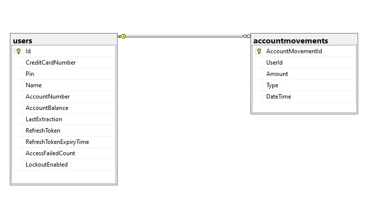

# Metafar.Challange

## Ejercicio

Se requiere desarrollar una API que permita las siguientes operaciones.

Endpoints:
<ol>
  <li>Endpoint Login: la api debe de contar con un endpoint donde dado un número de
tarjeta y un pin, el sistema debe validar que ambos son correctos y se condicen entre
ellos. El endpoint debe retornar un token JWT el cual será utilizado para acceder a los
otros endpoints. El usuario puede ingresar un PIN invalido hasta 4 veces, luego de
esto la tarjeta debe quedar bloqueada y ya no permitir el acceso.
 Endpoint Saldo: la api debe de contar con un endpoint el cual dado un nro de tarjeta
retorne la siguiente informacion: nombre del usuario, numero de cuenta, saldo actual y
fecha de la última extracción.</li>
  <li>Endpoint Retiro: la api debe contar con un endpoint el cual dado un número de tarjeta
y un montón, le permita realizar una extracción. En caso de que el monto a retirar sea
superior al saldo disponible de la tarjeta, el endpoint debe de retornar un código de
error. En caso de que todo sea correcto se debe retornar un resumen de la operación
realizada.</li>
  <li>Endpoint Operaciones: la api debe de contar con un endpoint el cual dado un número
de tarjeta debe retornar el historial de todas las operaciones realizadas. Dicha
respuesta debe de estar paginada, es decir, no debe devolver el historial todo junto,
sino que lo debe de hacer en páginas de 10 registros.</li>
</ol>

## Tarea

1. Crear la base de datos y todos los objetos que creas necesarios para que la aplicación </br>
funciones.
2. Insertar una cantidad mínima de datos para poder probar la aplicación.</br>
3. Desarrollar una aplicación web, en un repositorio público, utilizando una herramienta</br>
de versionado como github/bitbucket/etc, que responda a los requisitos descriptos por
el cliente.</br>
4. Entregar un diagrama de entidad relación de las tablas planteadas (DER)</br>

## Notas Técnicas
La arquitectura de la aplicación tiene que contener un proyecto de API Rest.</br>

### Base de datos:
Relacional (Sql Server 2022, Mysql 8.0.15, PostgreSQL 14)

### El stack tecnológico deberá ser
Para la API (elegir una opción): .Net Core &gt;= 6 (deseable utilizar swagger)

### Para acceso de base de datos:
o Entity Framework (deseable utilizar patron Repository)


## Sobre El Proyecto

El proyecto se desarrolló utilizando dotNET Core v6 y sigue una arquitectura orientada a servicios (SOA), que consta de las siguientes capas:

Presentation: REST API
Common: Helpers y extensiones
Data: Configuracion del dbContext, Entidades que representan el Modelo y Migraciones
Data.Service: Casos de uso y acceso a datos
Entities: Capa donde se guardan entidades y DTO
Testing: Capa en donde se testean los casos de uso (*)

(*) Por cuestiones de tiempo no fueron testeado todos los casos de uso.

Esta estructura de capas sigue una arquitectura bien organizada que promueve la separación de preocupaciones y la escalabilidad del proyecto. Cada capa tiene su responsabilidad específica, lo que facilita el desarrollo, la depuración y el mantenimiento del software.

Aunque el requisito es bastante simple, opté por organizarlo en capas para mantener un mayor orden y control en el proyecto, siguiendo los principios SOLID de diseño de software. Para resolver los casos de uso, creé las interfaces que configuré como Scoped en el archivo Program, y luego la inyecté a través de la inyección de dependencias en el controlador encargado de manejar la solicitud. Esta decisión se tomó con el objetivo de reducir el acoplamiento entre clases y facilitar la mantenibilidad del código, siguiendo el principio de Responsabilidad Única (Single Responsibility Principle) al separar las responsabilidades de cálculo de Fibonacci y controlador de API. Si el proyecto creciera de manera desmedida se recomendaria la implementacion de IMediator.

Actualmente, estoy versionando tanto la API como los DTOs utilizados en caso de que en el futuro se necesite realizar cambios críticos, siguiendo el principio de Abierto/Cerrado (Open/Closed Principle) al permitir extensiones sin modificar el código existente. Cualquier modificación se implementaría en una versión 2, dejando la versión 1 intacta, para seguir el principio de Interfaz Segregación (Interface Segregation Principle) y no forzar a los consumidores de la API a depender de funcionalidades innecesarias.

## DER



## Configuracion del proyecto

Existen dos tipos de base de datos listas para utilizar. SQL Server y Database in memory. Por paracilitar la prueba del proyecto se dejo configurada por defecto ésta última.

Si desea usar SQL Server siga los siguientes pasos

* En el método ConfigureServices ubicado en Metafar.Challange\Metafar.Challange\Boostrap.cs descomentar lineas 23 y 24

 ```
  //services.AddDbContext<MetafarDbContext>(options => options
  //.UseSqlServer(configuration.GetConnectionString("MetafarDb")
  ```

* Comentar lineas 26 y 27

  ```
  services.AddDbContext<MetafarDbContext>(options => options
   .UseInMemoryDatabase(databaseName: "MetafarDb"));
  ```

* Configurar el connectionstring del appsettings.json: `"MetafarDb": "Server=localhost,1435;Initial Catalog=metafar;User ID=sa;Password=M@riano1!.;MultipleActiveResultSets=True"`

## Testing del proyecto

Puede probar el proyecto usando la página de swagger, la url por default es `https://localhost:44316/swagger/index.html.` O puede navegar a `serverUrl/swagger`. El proyecto tiene pre configurada una seed para cargar algunos datos con el propósito 
de probar los endpoints.

<pre>
Usuario1:
 CreditCardNumber: `371449635398431`
 PIN: `456`
</pre>

<pre>
Usuario2
 CreditCardNumber: `471449635398434`
 PIN: `654`
</pre>
